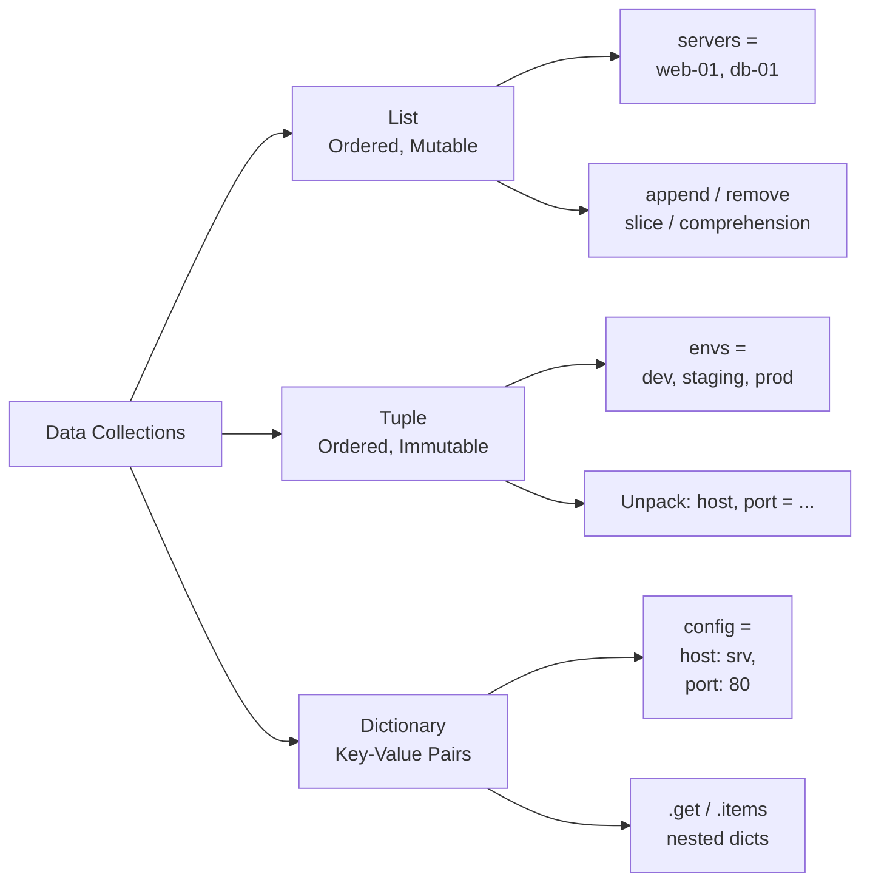

<div align="center">

# 🐍 Day 5 — Lists, Tuples & Dictionaries


</div>

---

## 📌 Introduction

Python's core data structures — lists, tuples, and dictionaries — are the foundation for storing and processing collections of data. Whether it's a list of servers, a fixed set of allowed environments, or a config dictionary, these structures appear in virtually every DevOps script.

Mastering them means you can parse inventory files, manage configs, process logs, and iterate infrastructure state — all critical real-world skills.

---

## 🔑 Key Concepts

- **List** `[]` — Ordered, mutable, allows duplicates
- **Tuple** `()` — Ordered, immutable (fixed), faster than list
- **Dictionary** `{}` — Key-value pairs, unordered (Python 3.7+ insertion-ordered)
- **List comprehension** — Concise way to create/filter lists
- **Slicing** — Extract parts of a list with `[start:stop:step]`
- **Nested structures** — Dicts of dicts, lists of dicts (common in configs & APIs)
- `.get()` on dicts — Safe key access without `KeyError`

---

## 📋 Code Examples

| Concept | Description | Example |
|---|---|---|
| Create list | Ordered collection | `servers = ["web-01", "db-01"]` |
| Append | Add to list | `servers.append("cache-01")` |
| Remove | Delete item | `servers.remove("db-01")` |
| Slicing | Extract subset | `servers[0:2]` |
| List comprehension | Filter/map list | `[s for s in lst if "web" in s]` |
| Create tuple | Immutable list | `envs = ("dev", "staging", "prod")` |
| Tuple unpack | Destructure | `host, port = ("srv", 8080)` |
| Create dict | Key-value store | `cfg = {"host": "srv", "port": 80}` |
| Dict access | Get by key | `cfg["host"]` |
| .get() | Safe access | `cfg.get("timeout", 30)` |
| Dict loop | Iterate pairs | `for k, v in cfg.items()` |
| Nested dict | Config object | `{"web": {"port": 80}}` |
| len() | Count items | `len(servers)` |
| in operator | Membership | `"prod" in envs` |

```python
# ─── Lists ──────────────────────────────────────────────────────
servers = ["web-01", "web-02", "db-01", "cache-01"]
servers.append("monitoring-01")
servers.remove("cache-01")
print(servers[0:2])   # ['web-01', 'web-02']

# List comprehension — filter web servers only
web_servers = [s for s in servers if "web" in s]
print(web_servers)    # ['web-01', 'web-02']

# ─── Tuples ─────────────────────────────────────────────────────
ALLOWED_ENVS = ("dev", "staging", "prod")
host, port   = ("prod-server", 443)
print("prod" in ALLOWED_ENVS)   # True

# ─── Dictionaries ───────────────────────────────────────────────
server_config = {
    "host":     "prod-web-01",
    "port":     443,
    "ssl":      True,
    "timeout":  30,
}

print(server_config["host"])              # prod-web-01
print(server_config.get("retries", 3))   # 3  (default)

for key, value in server_config.items():
    print(f"  {key}: {value}")
```

---

## 🛠️ Practical Examples

### 1️⃣ Server Inventory with List Comprehension
```python
inventory = ["web-01", "web-02", "db-01", "db-02", "cache-01", "monitor-01"]

web_nodes = [s for s in inventory if s.startswith("web")]
db_nodes  = [s for s in inventory if s.startswith("db")]

print(f"Web Nodes  ({len(web_nodes)}): {web_nodes}")
print(f"DB Nodes   ({len(db_nodes)}): {db_nodes}")

# Output:
# Web Nodes  (2): ['web-01', 'web-02']
# DB Nodes   (2): ['db-01', 'db-02']
```

### 2️⃣ Service Config Dictionary
```python
services = {
    "nginx":  {"port": 80,   "ssl": False, "replicas": 3},
    "api":    {"port": 8080, "ssl": True,  "replicas": 2},
    "db":     {"port": 5432, "ssl": True,  "replicas": 1},
}

print(f"{'Service':<10} {'Port':<8} {'SSL':<6} {'Replicas'}")
print("-" * 35)
for svc, cfg in services.items():
    ssl_label = "✅" if cfg["ssl"] else "❌"
    print(f"{svc:<10} {cfg['port']:<8} {ssl_label:<6} {cfg['replicas']}")

# Output:
# Service    Port     SSL    Replicas
# -----------------------------------
# nginx      80       ❌      3
# api        8080     ✅      2
# db         5432     ✅      1
```

### 3️⃣ Parsing Log Counts with Dict
```python
logs = ["ERROR", "INFO", "ERROR", "WARN", "INFO", "ERROR", "INFO", "WARN"]

counts = {}
for level in logs:
    counts[level] = counts.get(level, 0) + 1

for level, count in sorted(counts.items()):
    print(f"  {level:6}: {'█' * count} ({count})")

# Output:
#   ERROR : ███ (3)
#   INFO  : ███ (3)
#   WARN  : ██ (2)
```

---

## 🔀 Visualization



---

## 🌍 Real-World DevOps Usage

- **Server inventory** — List of hostnames iterated in automation scripts
- **Allowed environments** — Tuple of fixed values used as guard clauses
- **Service configs** — Nested dicts (mirrors JSON/YAML structure)
- **Log level counting** — Dict as a counter over log streams
- **API responses** — JSON parsed directly into Python dicts
- **CI/CD pipeline variables** — Lists of build steps, targets, or regions

---

## ✅ Summary

- Lists are mutable ordered collections; use for dynamic server/task lists
- Tuples are immutable; use for fixed constants and function return pairs
- Dicts are the go-to structure for named configurations and JSON-like data
- List comprehensions replace verbose `for` loops elegantly
- Always use `.get()` on dicts to avoid `KeyError` crashes in production

---

## ⏭️ What's Next

> **Day 6 → File Handling & I/O** — Reading config files, writing logs, parsing CSVs, and working with the filesystem in Python.

---

## 👤 Author

**Your Name** — *DevOps & Python Learner* 🚀

---

## ⭐ Support

If this helped you, please **star ⭐** the repo, **share** it with your network, and **follow** for daily updates!
