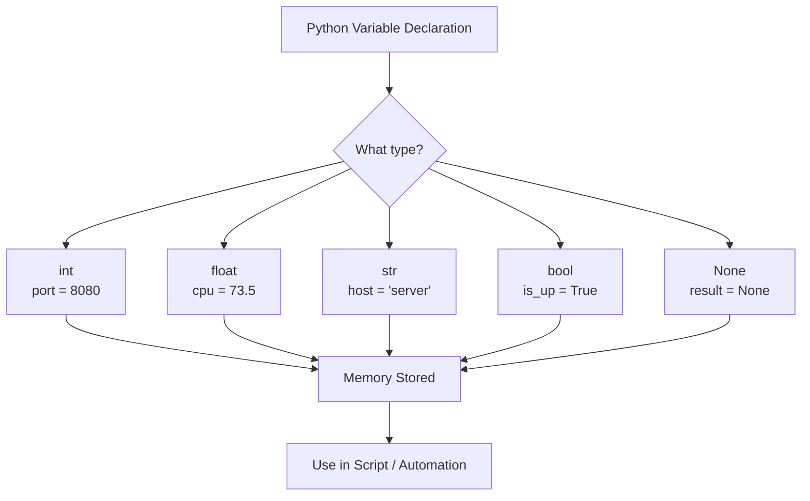

<div align="center">

# 🐍 Day 1 — Variables & Data Types


</div>

---

## 📌 Introduction

Variables are the building blocks of any Python program — they store data in memory for later use. Understanding Python's built-in data types is essential for writing scripts, automating tasks, and processing data in DevOps pipelines.

In real-world DevOps, you'll use variables to store config values, server names, environment flags, and parsed log data — making this Day 1 knowledge critical.

---

## 🔑 Key Concepts

- Python is **dynamically typed** — no need to declare types explicitly
- Variables are **case-sensitive** (`host` ≠ `Host`)
- Python has **5 core built-in types**: `int`, `float`, `str`, `bool`, `NoneType`
- Use `type()` to inspect any variable at runtime
- **f-strings** are the modern, preferred way to format strings

---

## 📋 Code Examples

| Concept | Description | Example |
|---|---|---|
| Integer | Whole number | `port = 8080` |
| Float | Decimal number | `cpu_usage = 73.5` |
| String | Text value | `host = "prod-server-01"` |
| Boolean | True / False flag | `is_running = True` |
| NoneType | Absence of value | `result = None` |
| Type check | Inspect type | `type(port)` → `<class 'int'>` |
| String concat | Join strings | `"host:" + host` |
| f-string | Format string | `f"CPU: {cpu_usage}%"` |
| Multi-assign | Assign at once | `a, b, c = 1, 2, 3` |
| Constants | Naming convention | `MAX_RETRIES = 5` |
| Type cast | Convert type | `int("404")` → `404` |
| String methods | Built-in ops | `"Hello".lower()` → `"hello"` |

```python
# ─── Core Variable Types ───────────────────────────────────────
port        = 8080               # int
cpu_usage   = 73.5               # float
hostname    = "prod-server-01"   # str
is_healthy  = True               # bool
token       = None               # NoneType

# ─── Type Inspection ───────────────────────────────────────────
print(type(port))        # <class 'int'>
print(type(hostname))    # <class 'str'>

# ─── f-strings ─────────────────────────────────────────────────
print(f"Server: {hostname} | Port: {port} | CPU: {cpu_usage}%")

# ─── Type Casting ──────────────────────────────────────────────
status_code = int("404")
threshold   = float("0.85")

# ─── Multiple Assignment ────────────────────────────────────────
env, region, zone = "prod", "us-east", "az1"
```

---

## 🛠️ Practical Examples

### 1️⃣ Server Config Variables
```python
# Simulating reading server config
server_name   = "nginx-prod-01"
server_port   = 443
is_ssl        = True
max_conn      = 1000

print(f"[CONFIG] {server_name}:{server_port} | SSL={is_ssl} | MaxConn={max_conn}")
# Output: [CONFIG] nginx-prod-01:443 | SSL=True | MaxConn=1000
```

### 2️⃣ Parsing an Environment Variable
```python
import os

# Reading env variable (common in CI/CD)
env = os.getenv("DEPLOY_ENV", "staging")   # default: staging
debug = os.getenv("DEBUG", "false") == "true"

print(f"Environment: {env} | Debug Mode: {debug}")
# Output: Environment: staging | Debug Mode: False
```

### 3️⃣ Type Casting from Config File
```python
# Config values often come as strings — need casting
raw_timeout = "30"
raw_retries = "3"

timeout = int(raw_timeout)
retries = int(raw_retries)

print(f"Timeout: {timeout}s | Max Retries: {retries}")
# Output: Timeout: 30s | Max Retries: 3
```

---

## 🔀 Visualization



---

## 🌍 Real-World DevOps Usage

- **Environment Variables** — Store secrets, API keys, and deploy targets
- **CI/CD Pipelines** — Pass build numbers, branch names, and flags as variables
- **Log Parsing Scripts** — Extract strings, integers from log lines
- **Infrastructure Scripts** — Store server IPs, ports, timeouts as typed variables
- **Config Management** — Cast string values from YAML/JSON into proper types

---

## ✅ Summary

- Python variables are dynamically typed — no declaration needed
- Core types: `int`, `float`, `str`, `bool`, `None`
- Use `type()` to inspect and `int()`, `str()`, `float()` to cast
- f-strings (`f"..."`) are the modern standard for string formatting
- Constants use `UPPER_SNAKE_CASE` by convention

---

## ⏭️ What's Next

> **Day 3 → Control Flow** — `if/else`, `for` loops, `while` loops, and conditional logic for automation scripts.

---

## 👤 Author

**Your Name** — *DevOps & Python Learner* 🚀

---

## ⭐ Support

If this helped you, please **star ⭐** the repo, **share** it with your network, and **follow** for daily updates!
