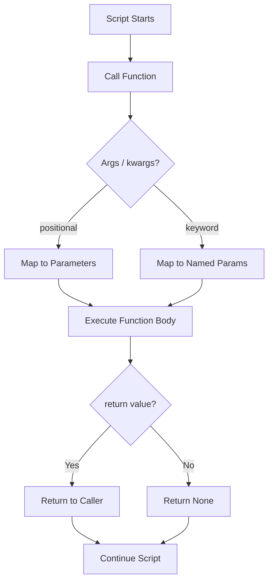

<div align="center">

# 🐍 Day 4 — Functions & Scope


</div>

---

## 📌 Introduction

Functions let you package reusable logic into clean, callable blocks — the key to writing maintainable scripts. Instead of repeating code, you define it once and call it anywhere.

In DevOps, functions power health checks, deployment steps, notification systems, and configuration loaders — making your automation scripts modular, testable, and readable.

---

## 🔑 Key Concepts

- `def` keyword defines a function
- Functions can accept **parameters** and return values with `return`
- **Default arguments** make parameters optional
- **`*args`** — accept variable positional arguments
- **`**kwargs`** — accept variable keyword arguments
- **Scope**: local variables live inside functions; global variables are accessible everywhere
- `lambda` — anonymous one-line functions
- Docstrings (`"""..."""`) document what a function does

---

## 📋 Code Examples

| Concept | Description | Example |
|---|---|---|
| Basic function | Define + call | `def greet(): print("hi")` |
| Parameters | Accept input | `def ping(host, port): ...` |
| Return value | Output result | `return status` |
| Default arg | Optional param | `def connect(host, port=80)` |
| *args | Variable args | `def log(*messages): ...` |
| **kwargs | Keyword args | `def config(**opts): ...` |
| Lambda | One-liner fn | `double = lambda x: x * 2` |
| Docstring | Document fn | `"""Checks server health."""` |
| Local scope | Var in fn only | `x = 1` inside function |
| Global scope | Var everywhere | `global timeout` |
| Return tuple | Multiple returns | `return ok, latency` |
| Nested fn | fn inside fn | `def outer(): def inner(): ...` |

```python
# ─── Basic Function ─────────────────────────────────────────────
def greet_server(name):
    """Returns a greeting for the given server."""
    return f"👋 Hello, {name}!"

print(greet_server("prod-web-01"))

# ─── Default Arguments ──────────────────────────────────────────
def connect(host, port=80, protocol="http"):
    return f"{protocol}://{host}:{port}"

print(connect("example.com"))             # http://example.com:80
print(connect("example.com", 443, "https"))  # https://example.com:443

# ─── *args and **kwargs ─────────────────────────────────────────
def log_event(*messages, level="INFO"):
    for msg in messages:
        print(f"[{level}] {msg}")

log_event("Deploy started", "Tests running", level="DEBUG")

# ─── Return multiple values ─────────────────────────────────────
def check_server(host):
    latency = 42   # ms (simulated)
    healthy = latency < 100
    return healthy, latency

ok, ms = check_server("db-01")
print(f"Healthy: {ok} | Latency: {ms}ms")

# ─── Lambda ─────────────────────────────────────────────────────
is_error = lambda code: code >= 400
print(is_error(503))   # True
```

---

## 🛠️ Practical Examples

### 1️⃣ Reusable Health Check Function
```python
def health_check(server: str, port: int = 80) -> dict:
    """Simulate a server health check."""
    import random
    latency = random.randint(10, 200)
    status  = "healthy" if latency < 150 else "degraded"
    return {"server": server, "port": port, "latency_ms": latency, "status": status}

servers = ["web-01", "web-02", "api-gw"]
for srv in servers:
    result = health_check(srv, port=443)
    icon = "✅" if result["status"] == "healthy" else "⚠️"
    print(f"{icon} {result['server']}:{result['port']} — {result['latency_ms']}ms [{result['status']}]")
```

### 2️⃣ Notification Function with *args
```python
def send_alert(channel: str, *messages, severity="INFO"):
    """Send multiple alert messages to a channel."""
    print(f"\n📢 [{severity}] → #{channel}")
    for msg in messages:
        print(f"   • {msg}")

send_alert("ops-alerts",
           "CPU > 90% on web-01",
           "Memory 85% on db-02",
           severity="CRITICAL")
# Output:
# 📢 [CRITICAL] → #ops-alerts
#    • CPU > 90% on web-01
#    • Memory 85% on db-02
```

### 3️⃣ Config Loader with **kwargs
```python
def build_config(**kwargs):
    """Build a deployment config dict from keyword arguments."""
    defaults = {"env": "staging", "replicas": 2, "debug": False}
    defaults.update(kwargs)
    return defaults

cfg = build_config(env="prod", replicas=5, debug=False)
for k, v in cfg.items():
    print(f"  {k}: {v}")
# Output:
#   env: prod
#   replicas: 5
#   debug: False
```

---

## 🔀 Visualization



---

## 🌍 Real-World DevOps Usage

- **Health check modules** — `def check_endpoint(url)` called per service
- **Deployment functions** — `def deploy(env, version)` with default fallback
- **Alert dispatchers** — `def notify(*channels, **payload)` for multi-channel alerts
- **Config builders** — `def load_config(**overrides)` merging defaults
- **CI/CD steps** — Each pipeline stage as an isolated function for testability

---

## ✅ Summary

- Use `def` to create reusable, readable function blocks
- Default args make functions flexible without extra logic
- `*args` handles variable positional inputs; `**kwargs` handles named inputs
- Always use `return` to pass results back to the caller
- Keep functions small and focused — one responsibility per function

---

## ⏭️ What's Next

> **Day 5 → Lists, Tuples & Dictionaries** — Python's core data structures for storing, organizing, and processing collections of data.

---

## 👤 Author

**Your Name** — *DevOps & Python Learner* 🚀

---

## ⭐ Support

If this helped you, please **star ⭐** the repo, **share** it with your network, and **follow** for daily updates!
