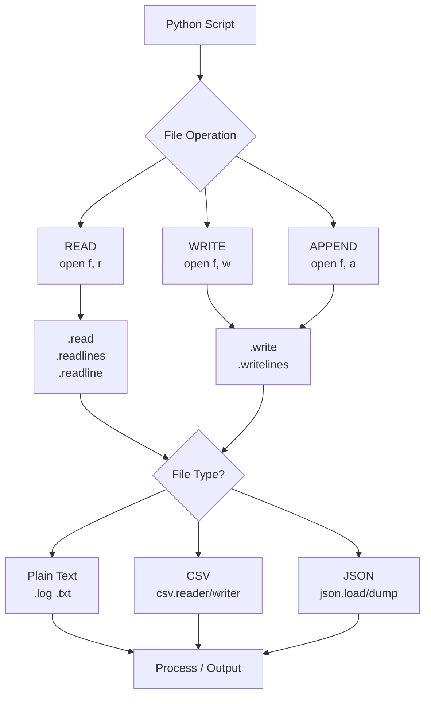

<div align="center">

# 🐍 Day 6 — File Handling & I/O


</div>

---

## 📌 Introduction

Reading and writing files is a core skill in any DevOps toolchain. Python makes it straightforward to read log files, write reports, parse CSVs, and manage configuration files — all without external tools.

Whether you're tailing logs, generating deployment reports, or reading an inventory file, file I/O is the bridge between your scripts and the filesystem.

---

## 🔑 Key Concepts

- `open(file, mode)` — Opens a file; modes: `r`, `w`, `a`, `r+`
- `with` statement — Context manager that auto-closes files safely
- `.read()` / `.readlines()` / `.readline()` — Read entire file, all lines, or one line
- `.write()` / `.writelines()` — Write to a file
- `csv` module — Parse/write CSV files cleanly
- `json` module — Read/write JSON config files
- `os.path` — Check file existence, get filenames and directories
- Always use `with open(...)` — prevents resource leaks

---

## 📋 Code Examples

| Concept | Description | Example |
|---|---|---|
| Read file | Read all content | `f.read()` |
| Read lines | List of lines | `f.readlines()` |
| Write file | Overwrite content | `open(f, "w")` |
| Append file | Add to end | `open(f, "a")` |
| with block | Auto-close file | `with open(...) as f:` |
| CSV read | Parse CSV rows | `csv.reader(f)` |
| CSV write | Write CSV rows | `csv.writer(f)` |
| JSON read | Load JSON | `json.load(f)` |
| JSON write | Dump JSON | `json.dump(data, f)` |
| File exists | Check presence | `os.path.exists(path)` |
| File size | Get size | `os.path.getsize(path)` |
| Basename | Get filename | `os.path.basename(path)` |

```python
import os, csv, json

# ─── Read a File ────────────────────────────────────────────────
with open("server.log", "r") as f:
    lines = f.readlines()
    for line in lines:
        print(line.strip())

# ─── Write a File ───────────────────────────────────────────────
with open("report.txt", "w") as f:
    f.write("=== Deploy Report ===\n")
    f.write("Status: SUCCESS\n")

# ─── Append to a File ───────────────────────────────────────────
with open("report.txt", "a") as f:
    f.write("Timestamp: 2025-01-01 10:00:00\n")

# ─── JSON Config ────────────────────────────────────────────────
config = {"env": "prod", "replicas": 3, "port": 443}

with open("config.json", "w") as f:
    json.dump(config, f, indent=2)

with open("config.json", "r") as f:
    loaded = json.load(f)
    print(loaded["env"])   # prod

# ─── File Checks ────────────────────────────────────────────────
path = "config.json"
if os.path.exists(path):
    print(f"✅ {os.path.basename(path)} ({os.path.getsize(path)} bytes)")
```

---

## 🛠️ Practical Examples

### 1️⃣ Log File Error Extractor
```python
# Simulated log file content
log_lines = [
    "2025-01-01 10:01 INFO  deploy started\n",
    "2025-01-01 10:02 ERROR timeout connecting to db-01\n",
    "2025-01-01 10:03 INFO  health check passed\n",
    "2025-01-01 10:04 ERROR disk usage 95% on web-02\n",
]

# Write a fake log
with open("app.log", "w") as f:
    f.writelines(log_lines)

# Read and filter errors
errors = []
with open("app.log", "r") as f:
    for line in f:
        if "ERROR" in line:
            errors.append(line.strip())

print(f"Found {len(errors)} error(s):")
for e in errors:
    print(f"  🔴 {e}")

# Output:
# Found 2 error(s):
#   🔴 2025-01-01 10:02 ERROR timeout connecting to db-01
#   🔴 2025-01-01 10:04 ERROR disk usage 95% on web-02
```

### 2️⃣ CSV Inventory Reader
```python
import csv

# Write a sample inventory CSV
rows = [
    ["hostname", "ip", "role"],
    ["web-01", "10.0.0.1", "webserver"],
    ["db-01",  "10.0.0.2", "database"],
    ["cache",  "10.0.0.3", "redis"],
]

with open("inventory.csv", "w", newline="") as f:
    csv.writer(f).writerows(rows)

# Read and display
with open("inventory.csv", "r") as f:
    reader = csv.DictReader(f)
    print(f"{'Host':<10} {'IP':<12} {'Role'}")
    print("-" * 30)
    for row in reader:
        print(f"{row['hostname']:<10} {row['ip']:<12} {row['role']}")

# Output:
# Host       IP           Role
# ------------------------------
# web-01     10.0.0.1     webserver
# db-01      10.0.0.2     database
# cache      10.0.0.3     redis
```

### 3️⃣ JSON Config Read + Write
```python
import json

# Load config (simulate reading from file)
config_data = {"environment": "prod", "replicas": 3, "ssl": True}

with open("deploy.json", "w") as f:
    json.dump(config_data, f, indent=2)

# Modify and re-save
with open("deploy.json", "r") as f:
    cfg = json.load(f)

cfg["replicas"] = 5   # Scale up
cfg["updated_by"] = "CI/CD Pipeline"

with open("deploy.json", "w") as f:
    json.dump(cfg, f, indent=2)

print("Updated config:")
for k, v in cfg.items():
    print(f"  {k}: {v}")
```

---

## 🔀 Visualization



---

## 🌍 Real-World DevOps Usage

- **Log analysis** — Read and filter `/var/log/` files in automation scripts
- **Config management** — Load JSON/YAML config files at runtime
- **Report generation** — Write deployment summaries to `.txt` or `.csv`
- **Inventory management** — Read CSV host lists for Ansible-style scripts
- **Pipeline artifacts** — Write test results or build info as JSON for downstream jobs

---

## ✅ Summary

- Always use `with open(...)` — it guarantees the file is closed properly
- Use `"r"` to read, `"w"` to overwrite, `"a"` to append
- `json` module handles config files natively
- `csv` module handles structured tabular data
- `os.path` functions help validate files before reading them

---

## ⏭️ What's Next

> **Day 7 → Modules & Packages** — Import the Python standard library, install third-party packages with `pip`, and organize your code into modules.

---

## 👤 Author

**Vadla Gunasekhar** — *DevOps & Python Learner* 🚀

---

## ⭐ Support

If this helped you, please **star ⭐** the repo, **share** it with your network, and **follow** for daily updates!
