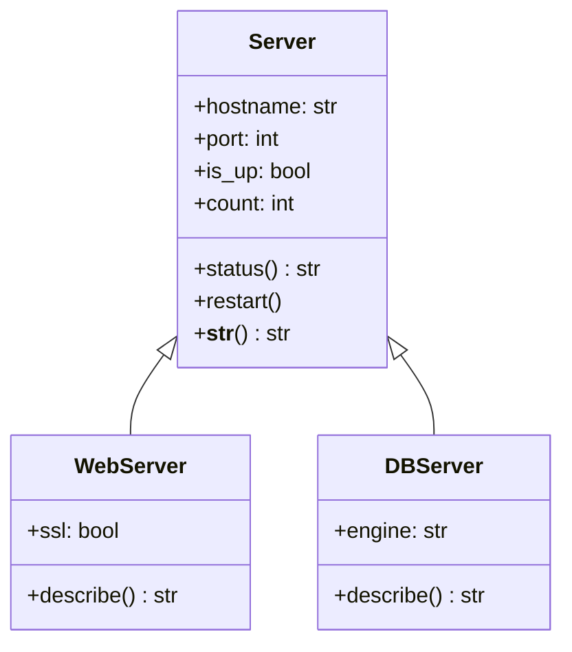

<div align="center">

# 🐍 Day 7 — OOP: Classes & Objects


</div>

---

## 📌 Introduction

Object-Oriented Programming (OOP) lets you model real-world entities — servers, deployments, pipelines — as Python objects with their own data and behavior. Instead of scattered variables and functions, you get clean, self-contained components.

In DevOps, OOP is used to build monitoring agents, infrastructure models, service clients, and CI/CD pipeline orchestrators — anything that benefits from organized, reusable structure.

---

## 🔑 Key Concepts

- **Class** — A blueprint for creating objects
- **Object / Instance** — A specific copy of a class
- `__init__` — Constructor method; runs when object is created
- **Attributes** — Data stored on the object (`self.host`)
- **Methods** — Functions defined inside a class
- **Inheritance** — A class can extend another class
- **`self`** — Refers to the current instance
- **`__str__`** — Controls how the object prints
- **Class variables** — Shared across all instances
- **Static methods** — Utility methods that don't need `self`

---

## 📋 Code Examples

| Concept | Description | Example |
|---|---|---|
| Define class | Blueprint | `class Server:` |
| Constructor | Initialize | `def __init__(self, host):` |
| Instance attribute | Per-object data | `self.host = host` |
| Method | Object behavior | `def ping(self): ...` |
| Create object | Instantiate | `s = Server("web-01")` |
| Access attribute | Read data | `s.host` |
| Call method | Run behavior | `s.ping()` |
| Class variable | Shared state | `Server.count = 0` |
| Inheritance | Extend class | `class WebServer(Server):` |
| Override | Redefine method | `def __str__(self):` |
| super() | Call parent | `super().__init__(...)` |
| Static method | No self needed | `@staticmethod def ...` |

```python
# ─── Define a Class ─────────────────────────────────────────────
class Server:
    count = 0  # Class variable — shared

    def __init__(self, hostname: str, port: int = 80, role: str = "generic"):
        self.hostname = hostname
        self.port     = port
        self.role     = role
        self.is_up    = True
        Server.count += 1

    def status(self) -> str:
        state = "✅ UP" if self.is_up else "❌ DOWN"
        return f"[{self.role.upper()}] {self.hostname}:{self.port} → {state}"

    def restart(self):
        self.is_up = True
        print(f"🔄 {self.hostname} restarted.")

    def __str__(self):
        return self.status()

# ─── Create Instances ───────────────────────────────────────────
web = Server("web-01", port=443, role="webserver")
db  = Server("db-01",  port=5432, role="database")

print(web)                      # [WEBSERVER] web-01:443 → ✅ UP
print(db)                       # [DATABASE] db-01:5432 → ✅ UP
print(f"Total servers: {Server.count}")   # 2
```

---

## 🛠️ Practical Examples

### 1️⃣ Server Class with Health Logic
```python
class Server:
    def __init__(self, hostname, port=80):
        self.hostname = hostname
        self.port     = port
        self.is_up    = True
        self._failures = 0

    def fail(self):
        self._failures += 1
        if self._failures >= 3:
            self.is_up = False
            print(f"🔴 {self.hostname} marked DOWN after {self._failures} failures.")

    def recover(self):
        self._failures = 0
        self.is_up = True
        print(f"✅ {self.hostname} recovered.")

    def report(self):
        state = "UP" if self.is_up else "DOWN"
        print(f"{self.hostname} | Status: {state} | Failures: {self._failures}")

srv = Server("api-gw", 8080)
srv.fail()
srv.fail()
srv.fail()    # Triggers DOWN
srv.report()
srv.recover()
srv.report()
```

### 2️⃣ Inheritance — Specialized Server Types
```python
class Server:
    def __init__(self, hostname, port):
        self.hostname = hostname
        self.port     = port

    def describe(self):
        return f"{self.hostname}:{self.port}"

class WebServer(Server):
    def __init__(self, hostname, ssl=True):
        port = 443 if ssl else 80
        super().__init__(hostname, port)
        self.ssl = ssl

    def describe(self):
        lock = "🔒" if self.ssl else "🔓"
        return f"{lock} {super().describe()} [Web]"

class DBServer(Server):
    def __init__(self, hostname, engine="postgres"):
        super().__init__(hostname, 5432)
        self.engine = engine

    def describe(self):
        return f"🗄️  {super().describe()} [{self.engine}]"

servers = [WebServer("nginx-01"), DBServer("pg-01", engine="postgres")]
for s in servers:
    print(s.describe())

# Output:
# 🔒 nginx-01:443 [Web]
# 🗄️  pg-01:5432 [postgres]
```

### 3️⃣ Deployment Pipeline Class
```python
from datetime import datetime

class Deployment:
    def __init__(self, app: str, version: str, env: str):
        self.app       = app
        self.version   = version
        self.env       = env
        self.status    = "pending"
        self.started   = None

    def start(self):
        self.started = datetime.now().strftime("%H:%M:%S")
        self.status  = "running"
        print(f"🚀 [{self.started}] Deploying {self.app} v{self.version} → {self.env}")

    def complete(self, success=True):
        self.status = "success" if success else "failed"
        icon = "✅" if success else "❌"
        print(f"{icon} Deployment {self.status.upper()}")

    def __str__(self):
        return f"Deployment({self.app} v{self.version} | {self.env} | {self.status})"

d = Deployment("my-api", "3.1.0", "prod")
d.start()
d.complete(success=True)
print(d)
```

---

## 🔀 Visualization



---

## 🌍 Real-World DevOps Usage

- **Infrastructure modeling** — `Server`, `LoadBalancer`, `Database` classes
- **CI/CD pipeline** — `Pipeline`, `Stage`, `Job` as objects with state
- **Monitoring agents** — `HealthMonitor` class that polls endpoints
- **Cloud SDK wrappers** — Wrap AWS/GCP API calls in clean service classes
- **Config managers** — `ConfigLoader` class with validation methods

---

## ✅ Summary

- Classes are blueprints; objects are specific instances
- `__init__` initializes attributes when an object is created
- Methods define behavior; `self` always refers to the current object
- Inheritance lets child classes extend and override parent classes
- `__str__` makes your objects print in a human-readable way

---

## ⏭️ What's Next

> **Day 8 → Error Handling & Exceptions** — Write robust scripts that handle failures gracefully using `try/except/finally`.

---

## ⭐ Support

If this helped you, please **star ⭐** the repo, **share** it with your network, and **follow** for daily updates!
