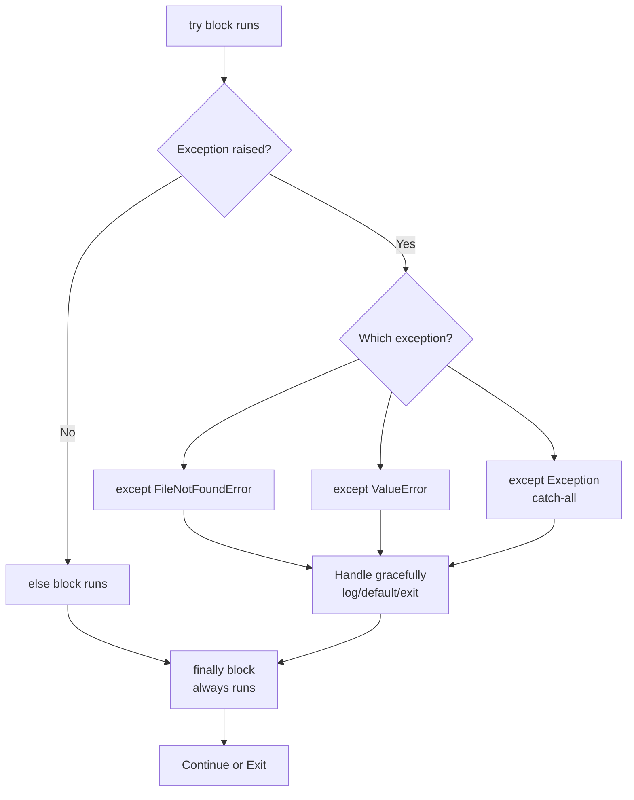

<div align="center">

# 🐍 Day 8 — Error Handling & Exceptions


</div>

---

## 📌 Introduction

No production script should crash without a plan. Python's exception handling lets you catch errors, log them gracefully, and recover or exit cleanly. This is the difference between a brittle automation script and a production-grade tool.

In DevOps, error handling keeps your pipelines stable when APIs fail, files are missing, or network connections drop — and ensures meaningful error messages for debugging.

---

## 🔑 Key Concepts

- `try` — Block where exceptions might occur
- `except` — Catch and handle a specific exception
- `else` — Runs if no exception was raised
- `finally` — Always runs (cleanup code)
- `raise` — Manually trigger an exception
- **Custom exceptions** — Define your own exception classes
- Common exceptions: `FileNotFoundError`, `ValueError`, `KeyError`, `ConnectionError`, `TimeoutError`
- `Exception as e` — Capture the error object for logging

---

## 📋 Code Examples

| Concept | Description | Example |
|---|---|---|
| try/except | Catch error | `try: ... except ValueError:` |
| Multiple except | Catch specific | `except (KeyError, TypeError):` |
| except as e | Get error msg | `except Exception as e: print(e)` |
| else clause | No error path | `else: print("success")` |
| finally | Always runs | `finally: f.close()` |
| raise | Trigger error | `raise ValueError("bad input")` |
| Custom exception | Own error type | `class DeployError(Exception):` |
| FileNotFoundError | Missing file | `except FileNotFoundError:` |
| KeyError | Missing key | `except KeyError:` |
| ConnectionError | Network fail | `except ConnectionError:` |
| ValueError | Bad value | `except ValueError:` |
| TimeoutError | Timeout hit | `except TimeoutError:` |

```python
# ─── Basic try/except ────────────────────────────────────────────
try:
    with open("config.json", "r") as f:
        import json
        cfg = json.load(f)
except FileNotFoundError:
    print("❌ Config file not found — using defaults.")
    cfg = {"env": "staging", "port": 80}
except json.JSONDecodeError as e:
    print(f"❌ Invalid JSON: {e}")
    cfg = {}
else:
    print("✅ Config loaded successfully.")
finally:
    print("🔚 Config loading step complete.")

# ─── Multiple exceptions ─────────────────────────────────────────
def parse_port(value):
    try:
        port = int(value)
        if not (1 <= port <= 65535):
            raise ValueError(f"Port {port} out of range")
        return port
    except (ValueError, TypeError) as e:
        print(f"⚠️  Invalid port: {e}")
        return 80   # Default

print(parse_port("443"))      # 443
print(parse_port("99999"))    # ⚠️  Invalid port → 80
print(parse_port("abc"))      # ⚠️  Invalid port → 80
```

---

## 🛠️ Practical Examples

### 1️⃣ Robust Config Loader
```python
import json, os

def load_config(path: str) -> dict:
    """Load JSON config with full error handling."""
    if not os.path.exists(path):
        print(f"⚠️  {path} not found — using defaults.")
        return {"env": "staging", "port": 80, "debug": True}
    try:
        with open(path, "r") as f:
            cfg = json.load(f)
        print(f"✅ Config loaded from {path}")
        return cfg
    except json.JSONDecodeError as e:
        print(f"❌ JSON parse error: {e}")
        return {}
    except PermissionError:
        print(f"❌ Permission denied: {path}")
        return {}

config = load_config("deploy.json")
print(f"Environment: {config.get('env', 'unknown')}")
```

### 2️⃣ Retry Decorator with Exception Handling
```python
import time

def retry(max_attempts=3, delay=1):
    """Decorator that retries a function on failure."""
    def decorator(func):
        def wrapper(*args, **kwargs):
            for attempt in range(1, max_attempts + 1):
                try:
                    return func(*args, **kwargs)
                except Exception as e:
                    print(f"⚠️  Attempt {attempt}/{max_attempts} failed: {e}")
                    if attempt < max_attempts:
                        time.sleep(delay)
            print("❌ All attempts exhausted.")
            return None
        return wrapper
    return decorator

@retry(max_attempts=3, delay=0)
def connect_to_db(host):
    """Simulated flaky DB connection."""
    import random
    if random.random() < 0.7:
        raise ConnectionError(f"Cannot connect to {host}")
    return f"✅ Connected to {host}"

result = connect_to_db("db-prod-01")
if result:
    print(result)
```

### 3️⃣ Custom Exception for Deploy Validation
```python
class DeployError(Exception):
    """Raised when a deployment validation fails."""
    pass

class ConfigError(Exception):
    """Raised when configuration is invalid."""
    pass

VALID_ENVS = ("dev", "staging", "prod")

def validate_deploy(env: str, version: str):
    if not version.startswith("v"):
        raise ConfigError(f"Version must start with 'v', got: {version}")
    if env not in VALID_ENVS:
        raise DeployError(f"Invalid env '{env}'. Must be one of {VALID_ENVS}")
    print(f"✅ Deploy validated: {version} → {env}")

try:
    validate_deploy("prod", "v2.1.0")     # OK
    validate_deploy("prod", "2.1.0")      # ConfigError
except DeployError as e:
    print(f"🚫 Deploy blocked: {e}")
except ConfigError as e:
    print(f"⚙️  Config issue: {e}")
```

---

## 🔀 Visualization



---

## 🌍 Real-World DevOps Usage

- **Config loading** — Catch `FileNotFoundError` and fall back to defaults
- **API calls** — Catch `ConnectionError` / `TimeoutError` with retry logic
- **Deploy validation** — Raise custom `DeployError` for invalid configs
- **Pipeline gates** — `sys.exit(1)` inside `except` to fail CI on critical error
- **Log parsers** — Catch `ValueError` when parsing malformed log lines

---

## ✅ Summary

- Wrap risky operations in `try/except` — never let automation crash silently
- Use specific exception types before broad `except Exception`
- `finally` is ideal for cleanup: closing files, releasing connections
- `raise` lets you propagate meaningful errors upward
- Custom exceptions make error types self-documenting in large codebases

---

## ⏭️ What's Next

> **Day 9 → Regular Expressions** — Use `re` module to match, search, and extract patterns from logs, configs, and command output.

---

## 👤 Author

**Your Name** — *DevOps & Python Learner* 🚀

---

## ⭐ Support

If this helped you, please **star ⭐** the repo, **share** it with your network, and **follow** for daily updates!
