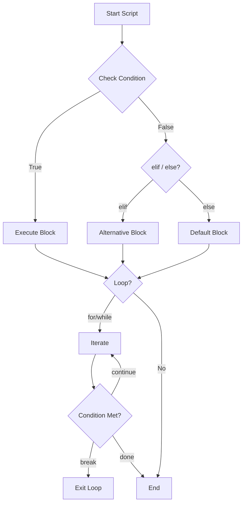

<div align="center">

# 🐍 Day 3 — Control Flow


</div>

---

## 📌 Introduction

Control flow lets your Python scripts make decisions and repeat actions — the backbone of any automation. With `if/elif/else`, `for`, and `while`, you can process server lists, trigger alerts, and react to conditions dynamically.

In DevOps, control flow is everywhere: checking deployment health, iterating over log files, retrying failed connections, and triggering different actions per environment.

---

## 🔑 Key Concepts

- `if / elif / else` — Branching based on conditions
- `for` loop — Iterate over lists, ranges, or collections
- `while` loop — Repeat while a condition is `True`
- `break` — Exit a loop early
- `continue` — Skip to next iteration
- `pass` — Placeholder; do nothing
- Comparison operators: `==`, `!=`, `<`, `>`, `<=`, `>=`
- Logical operators: `and`, `or`, `not`

---

## 📋 Code Examples

| Concept | Description | Example |
|---|---|---|
| if/else | Basic branching | `if status == 200: ...` |
| elif | Multiple conditions | `elif status == 404: ...` |
| Nested if | Condition inside condition | `if x: if y: ...` |
| for loop | Iterate a list | `for server in servers: ...` |
| range() | Numeric iteration | `for i in range(5): ...` |
| while loop | Repeat while True | `while retries < 3: ...` |
| break | Exit loop | `if done: break` |
| continue | Skip iteration | `if skip: continue` |
| in operator | Membership check | `if "error" in log: ...` |
| Ternary | One-line if-else | `x = "up" if ok else "down"` |
| enumerate | Index + value | `for i, s in enumerate(lst)` |
| Logical ops | and / or / not | `if a and not b: ...` |

```python
# ─── if / elif / else ──────────────────────────────────────────
status_code = 503

if status_code == 200:
    print("✅ Service healthy")
elif status_code == 404:
    print("⚠️  Resource not found")
elif status_code >= 500:
    print("🔴 Server error — alerting on-call!")
else:
    print(f"Unknown status: {status_code}")

# ─── for loop ──────────────────────────────────────────────────
servers = ["web-01", "web-02", "db-01"]
for server in servers:
    print(f"Pinging {server}...")

# ─── while + break ─────────────────────────────────────────────
retries = 0
while retries < 5:
    print(f"Attempt {retries + 1}")
    retries += 1
    if retries == 3:
        break   # Simulate success

# ─── Ternary expression ────────────────────────────────────────
cpu = 85
alert = "🔴 HIGH" if cpu > 80 else "✅ OK"
print(f"CPU Status: {alert}")
```

---

## 🛠️ Practical Examples

### 1️⃣ Health Check Over Multiple Servers
```python
servers = {
    "web-01": 200,
    "web-02": 503,
    "db-01":  200,
    "cache":  404,
}

for server, code in servers.items():
    status = "✅ UP" if code == 200 else "❌ DOWN"
    print(f"{server:10} → {code} {status}")

# Output:
# web-01     → 200 ✅ UP
# web-02     → 503 ❌ DOWN
# db-01      → 200 ✅ UP
# cache      → 404 ❌ DOWN
```

### 2️⃣ Retry Logic (Common in CI/CD)
```python
import time

MAX_RETRIES = 3
success = False

for attempt in range(1, MAX_RETRIES + 1):
    print(f"🔄 Attempt {attempt}/{MAX_RETRIES}...")
    # Simulate a flaky connection
    if attempt == 3:
        success = True
        break
    print("   ⚠️  Failed. Retrying...")

print("✅ Connected!" if success else "❌ All retries exhausted.")
```

### 3️⃣ Log Line Filtering
```python
logs = [
    "INFO: deploy started",
    "ERROR: timeout on db-01",
    "INFO: health check passed",
    "ERROR: disk 95% full on web-02",
]

print("=== ERROR REPORT ===")
for line in logs:
    if "ERROR" in line:
        print(f"  🔴 {line}")

# Output:
# === ERROR REPORT ===
#   🔴 ERROR: timeout on db-01
#   🔴 ERROR: disk 95% full on web-02
```

---

## 🔀 Visualization



---

## 🌍 Real-World DevOps Usage

- **Deployment scripts** — Branch on `if env == "prod": ...` to apply stricter checks
- **Retry mechanisms** — `while` loops with backoff for flaky API calls
- **Alert filtering** — Loop over logs and trigger alerts on `ERROR` lines
- **CI/CD gates** — `if test_result != "passed": sys.exit(1)`
- **Batch operations** — `for server in inventory: restart_service(server)`

---

## ✅ Summary

- `if/elif/else` handles decision branching cleanly
- `for` is ideal for iterating lists, dicts, and files
- `while` is used for retries and polling loops
- `break` and `continue` give fine-grained loop control
- Ternary expressions make simple conditionals one-liners

---

## ⏭️ What's Next

> **Day 4 → Functions & Scope** — Define reusable logic, understand local vs global scope, and build modular DevOps scripts.

---

## 👤 Author

**Vadla Gunasekhar** — *DevOps & Python Learner* 🚀

---

## ⭐ Support

If this helped you, please **star ⭐** the repo, **share** it with your network, and **follow** for daily updates!
